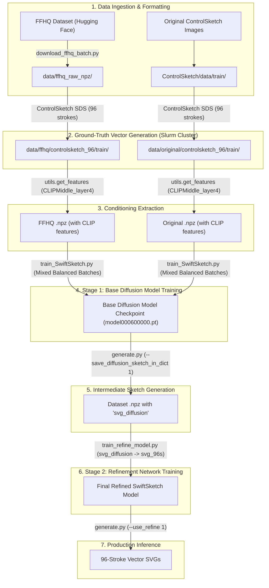

# SwiftSketch 96-Stroke Face-Oriented Training Pipeline

This document serves as the authoritative, end-to-end technical plan and persistent project memory for training a customized **96-stroke face-oriented SwiftSketch diffusion model**. The pipeline combines the general-domain objects from the original SwiftSketch/ControlSketch dataset with high-quality portrait faces from the FFHQ dataset.

---

## 🏗 System Architecture & Workflow

SwiftSketch is a **Conditional Diffusion Sequence-to-Sequence Transformer** that synthesizes parametric vector sketches ($N$ cubic Bézier curves, each defined by 4 2D control points) conditioned on visual feature maps from intermediate CLIP layers (`CLIPMiddle_layer4_features`).

Ground-truth vector supervision is obtained via **ControlSketch Score Distillation Sampling (SDS)**, which optimizes vector strokes against a pre-trained Stable Diffusion model before training the fast diffusion generator.



---

## 📦 `.npz` Data Dictionary Schema

All datasets are serialized as compressed `.npz` dictionaries. The schema evolves across the pipeline stages:

| Key | Type | Stage Added | Description |
| :--- | :--- | :--- | :--- |
| `image` | `bytes` (JPEG) | Phase 1 | Raw source image encoded as JPEG byte stream ($512 \times 512$). |
| `caption` | `str` | Phase 1 | Descriptive text prompt (e.g., `"A portrait photo of a person's face"`). |
| `mask` | `np.ndarray` (uint8) | Phase 1 / 2 | Binary foreground segmentation mask (auto-generated if missing). |
| `attn_map` | `np.ndarray` (float32)| Phase 1 / 2 | Cross-attention saliency heatmap (auto-generated if missing). |
| `svg_96s` | `np.ndarray` (float32)| Phase 2 | Ground-truth 96-stroke Bézier parameters produced by ControlSketch optimization. |
| `CLIPMiddle_layer4_features` | `torch.Tensor` | Phase 3 | $768$-dimensional intermediate visual embedding tensor from CLIP ViT-B/32. |
| `svg_diffusion` | `np.ndarray` (float32)| Phase 5 | Raw stroke predictions from the trained Stage 1 base diffusion model. |

---

## 📊 Milestone & Task Status

| Milestone / Task | Status | Component | Details |
| :--- | :---: | :--- | :--- |
| **Dynamic Slurm Batch Generator** | ✅ Complete | `slurm/generate_generation_jobs.py` | Added `--input_dir`, `--output_base_dir`, `--strokes`, `--job_prefix`, `--specific_batches`. |
| **Multi-Directory Training Patch** | ✅ Complete | `SwiftSketch/train/train_SwiftSketch.py` | Allows passing multiple paths to `--train_data_dir` for balanced dataset mixing. |
| **Custom Slurm Training Script** | ✅ Complete | `slurm/run_train_custom_96s.slurm` | Configured multi-GPU/single-GPU allocation on TAU Slurm cluster. |
| **FFHQ Streaming & Pack Script** | ✅ Complete | `download_ffhq_batch.py` | Streams `marcosv/ffhq-dataset`, resizes to $512 \times 512$, skips existing files, and saves compressed `.npz`. |
| **FFHQ Batch Download** | 🔄 Ready | `data/ffhq_raw_npz` | Target: 5,000–15,000 raw face `.npz` files. |
| **96-Stroke Target Generation** | ⏳ Pending | `slurm/submit_all_generation_jobs.sh` | Launch ControlSketch parallel jobs across GPU nodes for Original + FFHQ. |
| **CLIP Feature Extraction** | ⏳ Pending | `SwiftSketch/utils/get_features.py` | Extract `CLIPMiddle_layer4` embeddings for both 96-stroke datasets. |
| **Stage 1 Base Diffusion Training** | ⏳ Pending | `SwiftSketch/train/train_SwiftSketch.py` | Train 96-stroke base diffusion model on mixed distribution. |
| **Intermediate Sketch Baking** | ⏳ Pending | `SwiftSketch/generate.py` | Populate `.npz` files with raw diffusion predictions (`svg_diffusion`). |
| **Stage 2 Refinement Training** | ⏳ Pending | `SwiftSketch/refine_model/train_refine/train_refine_model.py` | Train refinement Transformer to eliminate artifacts and align strokes. |

---

## 🛠 Phase 1: FFHQ Data Acquisition & Formatting

Download and format raw face images from Hugging Face into base `.npz` containers without requiring local pre-computation of SDXL attention maps (ControlSketch generates masks and attention dynamically if omitted).

```bash
# Execute download script (streams and skips already downloaded files)
python download_ffhq_batch.py
```

> [!NOTE]
> The script downloads from `marcosv/ffhq-dataset`, resizes to $512 \times 512$, and writes to `data/ffhq_raw_npz/ffhq_batch_{idx}.npz`.

---

## ⚡ Phase 2: Distributed Ground-Truth Vector Generation (ControlSketch)

ControlSketch performs gradient-based score distillation to generate 96-stroke Bézier sketches (`svg_96s`). Because this optimization is compute-intensive, jobs are divided into batches of 100 images and distributed across the TAU Slurm cluster.

### 1. Generate Slurm Job Files

```bash
# Generate batch jobs for Original Dataset (Objects)
python slurm/generate_generation_jobs.py \
    --input_dir "ControlSketch/data/train" \
    --output_base_dir "data/original" \
    --strokes 96 \
    --job_prefix "orig" \
    --images_per_job 100

# Generate batch jobs for FFHQ Dataset (Faces)
python slurm/generate_generation_jobs.py \
    --input_dir "data/ffhq_raw_npz" \
    --output_base_dir "data/ffhq" \
    --strokes 96 \
    --job_prefix "ffhq" \
    --images_per_job 100
```

### 2. Submit Generation Jobs to Slurm

```bash
# Submit all 96-stroke generation jobs to the cluster queue
./slurm/submit_all_generation_jobs.sh 96
```

### 3. Monitor Progress

```bash
# Check generation progress and verify completed .npz targets
python slurm/check_progress.py

# Optional: Run the web-based monitoring server
python slurm/slurm_server.py
```

Output directories generated by these jobs:
- Original Dataset: `data/original/controlsketch_96/train`
- FFHQ Dataset: `data/ffhq/controlsketch_96/train`

---

## 🔍 Phase 3: CLIP Feature Extraction

SwiftSketch conditions its denoising process on deep visual features extracted from `CLIPMiddle_layer4`. After the 96-stroke vector sketches are generated, extract and write the embeddings directly into the `.npz` files:

```bash
cd SwiftSketch

# Extract features for Original Dataset
python -m utils.get_features \
    --dir_name "../data/original/controlsketch_96/train" \
    --network_name "CLIPMiddle_layer4"

# Extract features for FFHQ Dataset
python -m utils.get_features \
    --dir_name "../data/ffhq/controlsketch_96/train" \
    --network_name "CLIPMiddle_layer4"
```

> [!IMPORTANT]
> Ensure both directories complete feature extraction before starting model training. The training data loader expects the `CLIPMiddle_layer4_features` key in each `.npz` file.

---

## 🎯 Phase 4: Stage 1 Base Diffusion Model Training

Train the main SwiftSketch diffusion Transformer on the combined dataset (Original + FFHQ).

### Submitting via Slurm:
```bash
sbatch slurm/run_train_custom_96s.slurm
```

### Equivalent Direct Command:
```bash
cd SwiftSketch

python -m train.train_SwiftSketch \
    --num_strokes 96 \
    --train_data_dir "../data/original/controlsketch_96/train" "../data/ffhq/controlsketch_96/train" \
    --cat_data_size 5000 \
    --save_dir "./save/SwiftSketch_96s_FaceOriented" \
    --use_wandb 1 \
    --wandb_project_name "SwiftSketch-Protraitron" \
    --title "Train_96s_FaceOriented_" \
    --batch_size 16 \
    --num_steps 120000 \
    --lr 5e-05 \
    --save_interval 20000
```

### Key Training Parameters:
- `--num_strokes 96`: Configures the model architecture and target key name to `svg_96s`.
- `--train_data_dir`: Accepts multiple dataset paths, allowing seamless combination of faces and general objects.
- `--cat_data_size 5000`: Balances the sampling distribution across dataset directories (e.g., 5,000 items sampled per domain).
- `--num_steps 120000`: Total diffusion training steps with checkpoints saved every 20,000 steps.

---

## 🔄 Phase 5: Intermediate Sketch Generation for Refinement

The Stage 2 Refinement Network is trained to map noisy/approximate diffusion outputs (`svg_diffusion`) to clean ground-truth strokes (`svg_96s`). Use the trained Stage 1 base model to predict and append diffusion sketches back into the training `.npz` files:

```bash
cd SwiftSketch

# Bake predictions into Original Dataset
python -m generate \
    --model_path "./save/SwiftSketch_96s_FaceOriented/model000120000.pt" \
    --use_refine 0 \
    --save_diffusion_sketch_in_dict 1 \
    --input_data "../data/original/controlsketch_96/train"

# Bake predictions into FFHQ Dataset
python -m generate \
    --model_path "./save/SwiftSketch_96s_FaceOriented/model000120000.pt" \
    --use_refine 0 \
    --save_diffusion_sketch_in_dict 1 \
    --input_data "../data/ffhq/controlsketch_96/train"
```

---

## 🎨 Phase 6: Stage 2 Refinement Network Training

Train the refinement Transformer to polish stroke geometry, fix control point overlaps, and enhance facial contour fidelity:

```bash
cd SwiftSketch

python -m refine_model.train_refine.train_refine_model \
    --save_dir "./save/SwiftSketch_96s_FaceOriented_Refinement" \
    --resume_checkpoint "./save/SwiftSketch_96s_FaceOriented/model000120000.pt" \
    --train_data_dir "../data/original/controlsketch_96/train" "../data/ffhq/controlsketch_96/train" \
    --target_key_name "svg_96s" \
    --diffusion_key_name "svg_diffusion" \
    --num_steps 60000 \
    --batch_size 32 \
    --lr 1e-04 \
    --save_interval 10000
```

---

## 🚀 Phase 7: Inference & Evaluation

Generate refined 96-stroke vector portraits from any input image or test directory using the complete two-stage pipeline:

```bash
cd SwiftSketch

python -m generate \
    --model_path "./save/SwiftSketch_96s_FaceOriented/model000120000.pt" \
    --refine_model_path "./save/SwiftSketch_96s_FaceOriented_Refinement/model000060000.pt" \
    --use_refine 1 \
    --input_data "../Pictures/test_portraits" \
    --output_dir "../outputs/eval_portraits_96s" \
    --save_svg 1
```

---

## 🛡 TAU Slurm Cluster Best Practices & Operational Guidelines

1. **NetApp Quota Protection:**
   Redirect caches and conda environments away from the small home directory quota to NetApp storage:
   ```bash
   export HF_HOME="/vol/joberant_nobck/data/NLP_368307701_2526a/$USER/huggingface_cache"
   export CLIP_CACHE_DIR="/vol/joberant_nobck/data/NLP_368307701_2526a/$USER/clip_cache"
   export PYTORCH_CUDA_ALLOC_CONF=expandable_segments:True
   conda config --add pkgs_dirs /vol/joberant_nobck/data/NLP_368307701_2526a/$USER/conda_pkgs
   ```
2. **Git & Environment Commands:**
   Execute all `git clone`, `git pull`, and package installs on the **login node** (`slurm-client.cs.tau.ac.il`). Cluster compute nodes do not have `git` or external internet access.
3. **Hardware Acceleration & pydiffvg:**
   `pydiffvg` uses CUDA on the Slurm cluster GPUs and CPU fallback on macOS/MPS to avoid memory leak issues.

---

## ❓ Troubleshooting & Common Issues

- **Missing Key Error (`KeyError: 'CLIPMiddle_layer4_features'`):**
  Ensure you ran `python -m utils.get_features` on the directory before initiating training.
- **Out of Memory (OOM) during SDS Rasterization:**
  Reduce `--images_per_job` in `generate_generation_jobs.py` (default: 100) or check `PYTORCH_CUDA_ALLOC_CONF=expandable_segments:True`.
- **Incomplete Slurm Batches:**
  Use `python slurm/check_progress.py` to identify missing batch indices, then rerun `generate_generation_jobs.py` with `--specific_batches <BATCH_IDS>` to regenerate only the failed scripts.
