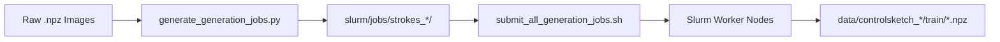
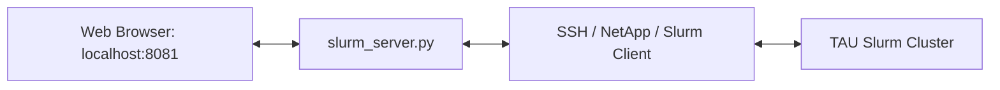

# 🚀 Running SwiftSketch / ControlSketch on the TAU CS Slurm Cluster

This guide provides a comprehensive walkthrough for configuring the environment, compiling GPU-accelerated rasterization dependencies, syncing datasets, generating multi-scale vector sketch datasets, training SwiftSketch models, and monitoring cluster jobs on the Tel Aviv University CS Slurm cluster.

---

## 📑 Table of Contents
1. [Overview & Advantages](#-overview--advantages)
2. [Prerequisites](#-prerequisites)
3. [Step 1: Clone Repository on NetApp Storage](#-step-1-clone-repository-on-netapp-storage)
4. [Step 2: Set Up Conda Environment](#-step-2-set-up-conda-environment)
5. [Step 3: Install Dependencies & Compile `diffvg` with CUDA](#-step-3-install-dependencies--compile-diffvg-with-cuda)
6. [Step 4: Sync Datasets to the Cluster](#-step-4-sync-datasets-to-the-cluster)
7. [Step 5: Step Comparison Optimization Experiments](#-step-5-step-comparison-optimization-experiments)
8. [Step 6: High-Throughput Batch Dataset Generation](#-step-6-high-throughput-batch-dataset-generation)
9. [Step 7: Progress Auditing & Ground-Truth Verification](#-step-7-progress-auditing--ground-truth-verification)
10. [Step 8: Model Training on Custom Datasets](#-step-8-model-training-on-custom-datasets)
11. [Step 9: Slurm Web Dashboard & Management Tool](#-step-9-slurm-web-dashboard--management-tool)
12. [Cluster Hardware, QOS Limits & Troubleshooting](#-cluster-hardware-qos-limits--troubleshooting)

---

## 🌟 Overview & Advantages

Executing optimization and training on the TAU Slurm cluster provides key acceleration advantages:
1. **GPU-Accelerated Differentiable Rasterization**: Unlike local macOS execution where rasterization defaults to CPU, the cluster's NVIDIA GPUs compile and run `pydiffvg` on CUDA, removing the primary compute bottleneck.
2. **Fast Stable Diffusion Backpropagation**: Score Distillation Sampling (SDS) loss runs across cluster GPUs (e.g., RTX 2080 Ti, Titan Xp, RTX 3090/A5000) with full mixed-precision support.
3. **Massive Parallel Dataset Processing**: Hundreds of batches can be queued simultaneously to process tens of thousands of image-to-vector sketches across multiple stroke budgets (48, 64, 96, 128 strokes).

---

## 📋 Prerequisites
1. **University VPN**: Ensure your TAU GlobalProtect VPN is active.
2. **SSH Access**: Ensure you have SSH key access configured for `slurm-client.cs.tau.ac.il`.

---

## 🛠️ Step 1: Clone Repository on NetApp Storage

Connect to the Slurm login node:
```bash
ssh $USER@slurm-client.cs.tau.ac.il
```

> [!IMPORTANT]
> **Run Git Commands ONLY on the Login Node (`slurm-client.cs.tau.ac.il`)**:
> Cluster compute nodes (e.g., `c-008`, `s-002`, `n-301`) run a minimal compute image without `git` installed (`git: command not found`). 
> Always execute `git clone`, `git pull`, and branch management on the login node **before** dispatching jobs.

Navigate to your high-capacity NetApp directory and clone the repository:
```bash
# Define your personal NetApp path
export MY_NETAPP_PATH="/vol/joberant_nobck/data/NLP_368307701_2526a/$USER"
cd "$MY_NETAPP_PATH"

# Clone repository
git clone https://github.com/Avner-Fivelovich/SwiftSketch-Protraitron.git SwiftSketch-Protraitron
cd SwiftSketch-Protraitron

# Fetch all branches and check out target branch
git fetch origin
git checkout main
```

---

## 🐍 Step 2: Set Up Conda Environment

Because your home folder has a strict quota (`Disk quota exceeded`), configure Conda to store all packages on the NetApp volume:

```bash
# Ensure Conda is available in the shell
source ~/.bashrc

# Redirect Conda package cache to NetApp storage
conda config --add pkgs_dirs /vol/joberant_nobck/data/NLP_368307701_2526a/$USER/conda_pkgs

# Create Conda environment with Python 3.9
conda create -y -n swiftsketch_env python=3.9.19

# Activate the environment
conda activate swiftsketch_env
```

---

## 📦 Step 3: Install Dependencies & Compile `diffvg` with CUDA

### 1. Redirect Temporary and Cache Directories
```bash
mkdir -p /vol/joberant_nobck/data/NLP_368307701_2526a/$USER/{pip_cache,tmp,huggingface_cache,clip_cache}
export PIP_CACHE_DIR="/vol/joberant_nobck/data/NLP_368307701_2526a/$USER/pip_cache"
export TMPDIR="/vol/joberant_nobck/data/NLP_368307701_2526a/$USER/tmp"
export HF_HOME="/vol/joberant_nobck/data/NLP_368307701_2526a/$USER/huggingface_cache"
export CLIP_CACHE_DIR="/vol/joberant_nobck/data/NLP_368307701_2526a/$USER/clip_cache"
```

### 2. Install PyTorch with CUDA 12.1 Support
> [!NOTE]
> PyTorch is pinned to `2.3.1` to maintain binary compatibility with `sm_61` (Titan Xp / GTX Titan X) and `sm_75` (RTX 2080 Ti) GPU architectures on student partitions.

```bash
pip install --force-reinstall torch==2.3.1 torchvision==0.18.1 torchaudio==2.3.1 --index-url https://download.pytorch.org/whl/cu121
```

### 3. Install Python Dependencies & OpenAI CLIP
```bash
# Install core dependencies (excluding flash-attn to maintain compatibility across all node architectures)
pip install -r slurm/requirements_relaxed.txt

# Install OpenAI CLIP from source
pip install git+https://github.com/openai/CLIP.git
```

### 4. Compile `diffvg` with GPU / CUDA Support
`diffvg` must be compiled against CUDA on the cluster. A policy patch is applied to `setup.py` to ensure compatibility with modern CMake versions:

```bash
# Clone diffvg repository
git clone --recursive https://github.com/BachiLi/diffvg.git
cd diffvg

# Apply CMake policy and C++14 standard patch
python -c "
with open('setup.py', 'r') as f:
    code = f.read()
code = code.replace(\"cmake_args = [\", \"cmake_args = ['-DCMAKE_POLICY_VERSION_MINIMUM=3.5', '-DCMAKE_CXX_STANDARD=14', \")
with open('setup.py', 'w') as f:
    f.write(code)
"

# Build and install diffvg
python setup.py install

# Return to repository root and remove temporary source
cd ..
rm -rf diffvg/
```

### 5. Verify Installation
```bash
python -c "import torch, pydiffvg; print('PyTorch CUDA:', torch.cuda.is_available(), '| Device Name:', torch.cuda.get_device_name(0) if torch.cuda.is_available() else 'N/A')"
```

---

## 💾 Step 4: Sync Datasets to the Cluster

Datasets under `ControlSketch/data/` or `data/ffhq_raw_npz/` should be synced from your local workstation to the cluster NetApp directory.

Run `rsync` from your **local machine terminal** (with TAU VPN active):

```bash
# Sync ControlSketch training data
rsync -avz --progress /Users/avnerf/Documents/GitHub/SwiftSketch-Protraitron/ControlSketch/data/ \
  $USER@slurm-client.cs.tau.ac.il:/vol/joberant_nobck/data/NLP_368307701_2526a/$USER/SwiftSketch-Protraitron/ControlSketch/data/

# Sync raw FFHQ dataset (if running portrait generation)
rsync -avz --progress /Users/avnerf/Documents/GitHub/SwiftSketch-Protraitron/data/ffhq_raw_npz/ \
  $USER@slurm-client.cs.tau.ac.il:/vol/joberant_nobck/data/NLP_368307701_2526a/$USER/SwiftSketch-Protraitron/data/ffhq_raw_npz/
```

---

## 🏃‍♂️ Step 5: Step Comparison Optimization Experiments

Run comparative step ablation studies (16 strokes vs 64 strokes) using preconfigured Slurm batch scripts:

```bash
# Ensure log directories exist
mkdir -p outputs/logs

# Submit 16-stroke comparison run
sbatch slurm/run_step_comparison.slurm

# Submit 64-stroke comparison run
sbatch slurm/run_step_comparison_64.slurm
```

### Useful Slurm Management Commands
* **Inspect active and queued jobs**:
  ```bash
  squeue --me
  squeue --me --sort=i  # Sorted by job ID
  ```
* **Follow live execution logs**:
  ```bash
  tail -f outputs/logs/ss_comp_16_<JOB_ID>.out
  ```
* **Cancel running or pending jobs**:
  ```bash
  scancel <JOB_ID>
  scancel -u $USER      # Cancel all jobs under your user account
  ```

---

## 🎨 Step 6: High-Throughput Batch Dataset Generation

To train SwiftSketch models with varying levels of abstraction, generate multi-stroke vector datasets (`svg_48s`, `svg_64s`, `svg_96s`, `svg_128s`) along with CLIP middle-layer visual feature representations.



### 1. Generate Batch Slurm Scripts
`slurm/generate_generation_jobs.py` automatically scans input datasets, partitions images into balanced subsets, and writes parameterized `.slurm` job scripts:

```bash
# Generate jobs for default dataset (all 4 stroke budgets: 48, 64, 96, 128)
python slurm/generate_generation_jobs.py

# Generate jobs for a specific stroke count and custom input folder
python slurm/generate_generation_jobs.py \
  --input_dir data/ffhq_raw_npz \
  --output_base_dir data/ffhq \
  --strokes 96 \
  --images_per_job 50 \
  --max_files 15000 \
  --job_prefix ffhq
```

#### Supported Generator Arguments:
| Argument | Default | Description |
|---|---|---|
| `--input_dir` | `ControlSketch/data/train` | Directory containing source `.npz` files |
| `--output_base_dir` | `data` | Base output directory for generated `.npz` files |
| `--strokes` | `[48, 64, 96, 128]` | List of stroke count targets to generate |
| `--images_per_job` | `100` | Number of images assigned per Slurm job script |
| `--max_files` | `None` | Max files to process, using stratified category sampling |
| `--allowed_categories` | `None` | Restrict generation to specific category subdirectories |
| `--job_prefix` | `orig` | Prefix string for Slurm job names (e.g., `orig`, `ffhq`) |
| `--specific_batches` | `None` | Generate only specific batch indices (e.g., `21 47`) |

### 2. Submit Generation Jobs to the Cluster Queue
`submit_all_generation_jobs.sh` queues the batch files sequentially by stroke group, adding a polite 0.1s throttle between `sbatch` invocations:

```bash
# Make script executable
chmod +x slurm/submit_all_generation_jobs.sh

# Submit all stroke groups (48, 64, 96, 128)
./slurm/submit_all_generation_jobs.sh

# Or target only 96 strokes
./slurm/submit_all_generation_jobs.sh 96
```

### 3. Output Directory Layout
* **Generated Datasets**:
  * `data/controlsketch_48/train/`
  * `data/controlsketch_64/train/`
  * `data/controlsketch_96/train/`
  * `data/controlsketch_128/train/`
* **Execution Logs**:
  * `outputs/logs/strokes_48/`
  * `outputs/logs/strokes_64/`
  * `outputs/logs/strokes_96/`
  * `outputs/logs/strokes_128/`

---

## 🔍 Step 7: Progress Auditing & Ground-Truth Verification

To verify generated `.npz` files (ensuring non-corrupted SVG keys and tracking cluster throughput), run `check_progress.py`:

```bash
python slurm/check_progress.py
```

### Progress Auditor Features:
* **Ground-Truth Physical Scan**: Directly verifies that output `.npz` files exist and contain valid `svg_96s` dictionary entries.
* **Cluster Throughput Metrics**: Calculates average seconds per image, images processed per GPU/hour, and projected daily cluster yield.
* **Missing Block Detection**: Identifies incomplete or unstarted batches, printing collapsed batch ranges (e.g., `Blocks 12, 14-18`) for easy re-submission with `--specific_batches`.

---

## 🏋️‍♂️ Step 8: Model Training on Custom Datasets

Once multi-stroke datasets are prepared, dispatch full SwiftSketch training jobs using `run_train_custom_96s.slurm`:

```bash
# Submit 96-stroke custom training job
sbatch slurm/run_train_custom_96s.slurm
```

### Training Configuration Highlights:
* **Multi-Directory Ingestion**: Supports training simultaneously across multiple dataset sources (e.g., original ControlSketch dataset + custom FFHQ dataset):
  ```bash
  python -m train.train_SwiftSketch \
      --num_strokes 96 \
      --train_data_dir "data/original/controlsketch_96/train" "data/ffhq/controlsketch_96/train" \
      --cat_data_size 25000 \
      --save_dir "outputs/train_96s_custom" \
      --use_wandb 1 \
      --wandb_project_name "SwiftSketch-Protraitron" \
      --batch_size 8 \
      --num_steps 120000 \
      --save_interval 20000
  ```
* **Experiment Tracking**: Automatic logging to Weights & Biases (WandB).
* **Checkpointing**: Checkpoints saved every 20,000 steps to `outputs/train_96s_custom/`.

---

## 🖥️ Step 9: Slurm Web Dashboard & Management Tool

A local Python web server (`slurm/slurm_server.py`) and single-page dashboard (`slurm/slurm_dashboard.html`) are included for real-time monitoring and visual experiment management.



### Starting the Dashboard:
```bash
# Run locally on port 8081
python slurm/slurm_server.py
```
Open `http://localhost:8081` in your browser to:
* View live queue states (`squeue`), CPU/GPU memory loads, and active node allocations.
* Stream stdout/stderr log files with auto-scroll.
* Generate and trigger custom multi-stroke jobs via a web UI.
* Trigger background dataset synchronization (`rsync`).

---

## ⚠️ Cluster Hardware, QOS Limits & Troubleshooting

### 1. Node Classifications & Partition Layout
| Node Partition / Nodes | Hardware Specs | Typical Workload |
|---|---|---|
| **SLURM-STUDENTS-NODES**<br>`s-002` to `s-006` | **NVIDIA TITAN Xp** (12 GB)<br>**GeForce RTX 2080 Ti** (11 GB) | Batch dataset generation, feature extraction |
| **SLURM-CLIENT-NODES**<br>`c-001` to `c-010`, `n-007` | **NVIDIA TITAN Xp** (12 GB)<br>**GeForce GTX TITAN X** (12 GB) | Quick tests, interactive debugging |
| **SLURM-RESEARCH-NODES**<br>`n-301` to `n-307`, `n-501` to `n-503`, `n-801` to `n-805`, `n-h200`, `n-b200` | **RTX 3090 / A5000** (24 GB)<br>**RTX A6000 / L40S** (46–48 GB)<br>**H100 / H200 / B200** (80–180 GB) | Large-scale SwiftSketch training, high-resolution rendering |

### 2. QOS Limit Constraints (`QOSMaxGRESPerUser`)
* **Symptom**: Jobs in `squeue` show pending state `PD` with reason `(QOSMaxGRESPerUser)`.
* **Explanation**: The cluster QOS policy limits individual users to **20–25 concurrent GPUs**.
* **Action**: No manual intervention is needed. You may safely submit all generated batch scripts at once; Slurm will schedule and dispatch them automatically as GPU slots free up.

### 3. Common Issues & Solutions

#### `Disk quota exceeded`
* **Cause**: Files or caches are writing to your home directory (`~`) instead of NetApp storage.
* **Fix**: Ensure `PIP_CACHE_DIR`, `TMPDIR`, `HF_HOME`, `CLIP_CACHE_DIR`, and Conda `pkgs_dirs` are all pointed to `/vol/joberant_nobck/data/NLP_368307701_2526a/$USER/`.

#### `CUDA out of memory` / VRAM Fragmentation
* **Cause**: PyTorch memory allocator fragmentation during SDS loss backpropagation.
* **Fix**: Add the expandable segments flag before running Python scripts:
  ```bash
  export PYTORCH_CUDA_ALLOC_CONF=expandable_segments:True
  ```

#### `git: command not found` on Compute Nodes
* **Cause**: Compute nodes run a lightweight execution environment without git binaries.
* **Fix**: Run all git commands on the login node (`slurm-client.cs.tau.ac.il`) prior to job submission.

#### `diffvg` Compilation Failure (`CMake Minimum Policy`)
* **Cause**: Newer CMake releases require explicit policy minimum declarations.
* **Fix**: Ensure the `-DCMAKE_POLICY_VERSION_MINIMUM=3.5` and `-DCMAKE_CXX_STANDARD=14` flags are injected into `setup.py` as detailed in [Step 3](#-step-3-install-dependencies--compile-diffvg-with-cuda).
